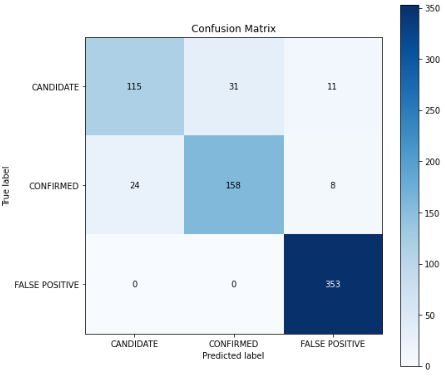
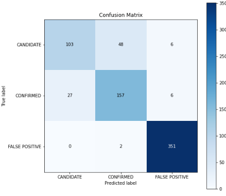
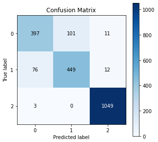

## Background

Over a period of nine years in deep space, the NASA Kepler space telescope has been out on a planet-hunting mission to discover hidden planets outside of our solar system.

To help process this data, create machine learning models capable of classifying candidate exoplanets from the raw dataset.

## Two different classifications are used.

- RandomForest

```

                precision    recall  f1-score   support

     CANDIDATE       0.83      0.73      0.78       157
     CONFIRMED       0.84      0.83      0.83       190
FALSE POSITIVE       0.95      1.00      0.97       353

      accuracy                           0.89       700
     macro avg       0.87      0.85      0.86       700
  weighted avg       0.89      0.89      0.89       700
```



- SVC

```

               precision    recall  f1-score   support

     CANDIDATE       0.79      0.66      0.72       157
     CONFIRMED       0.76      0.83      0.79       190
FALSE POSITIVE       0.97      0.99      0.98       353

      accuracy                           0.87       700
     macro avg       0.84      0.83      0.83       700
  weighted avg       0.87      0.87      0.87       700
```



- Neural Network (Tensorflow)

```
               precision    recall  f1-score   support

           0       0.83      0.78      0.81       509
           1       0.82      0.84      0.83       537
           2       0.98      1.00      0.99      1052

    accuracy                           0.90      2098
   macro avg       0.88      0.87      0.87      2098
weighted avg       0.90      0.90      0.90      2098

```



## Conclusion

RandomForest performance is slightly better than SVC. However, its model size of RandomForest is 50MB while SVC model size is about 1MB. RamdomForest takes a lot more computation power and storage size for its model.  
ANN model shows better performance than RamdomForest and SVC.
